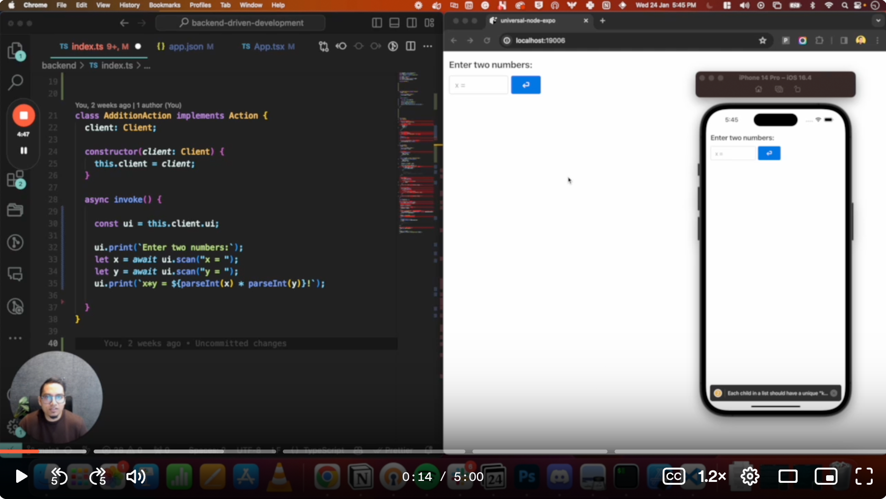

# Backend Driven Universal Apps 🚨 (Experimental)

> ⚠️⚠ This is an experimental project, a proof-of-concept to bring the easy way of coding fullstack apps using backend code only, similar to the old days of printf() and scanf(). ⚠⚠️

## Why?

Taking inspirations from the WordPress Plugin system. Wouldn't it be easy if we could install plugins for **Google Analytics**, **Social Login**, **E-commerce** (maybe) and customize as you need!

## Demo

[](https://www.loom.com/share/5354c3e306cb41ec92daa4b00130c5bd](https://www.loom.com/share/eb731f2a327f456ab0986bcb8f616357) "Backend Driven Universal Apps")

## The state of this experiment

This is a very early experiment that has two parts.

- **Backend framework**: Provides a way to create actions with an invoke method() where users can write their code. It has the framework code as well that wouldn't be a part of the user's project

- **Frotnend renderer**: The frontend uses Expo with gluestack-ui for rendering web and mobile apps. Users don't need to change anything here. It's all part of the framework.

## Folder structure

```
frontend/
  App.tsx
backend/
  index.ts
```

## Running the dev environment

First, run the development server:

```bash
cd frontend
npm start
[ press w or i to open web or iOS ]
```

```bash
cd backend
bun index.ts
```
